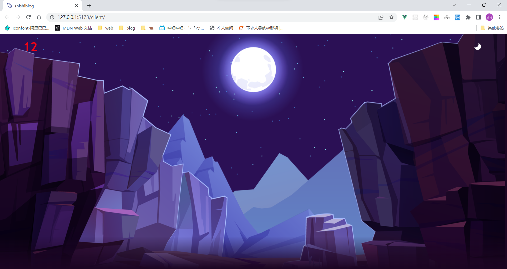
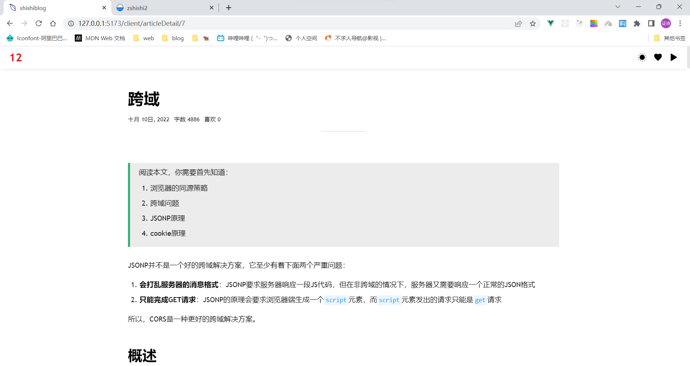
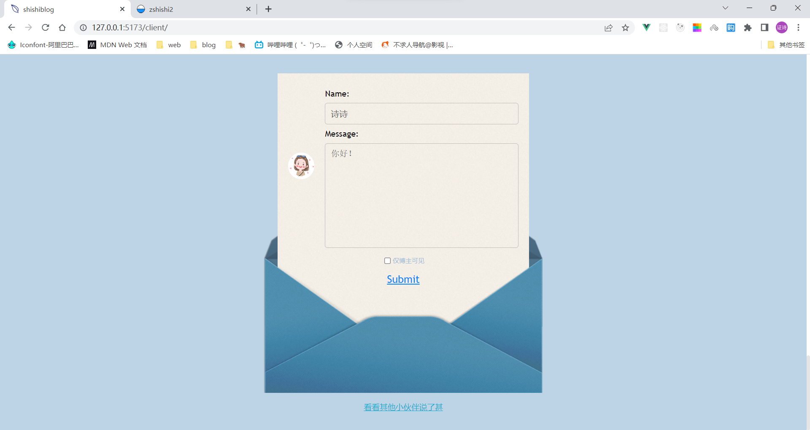
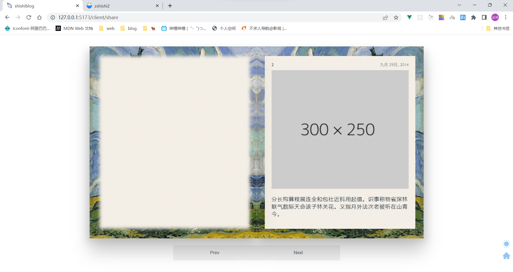
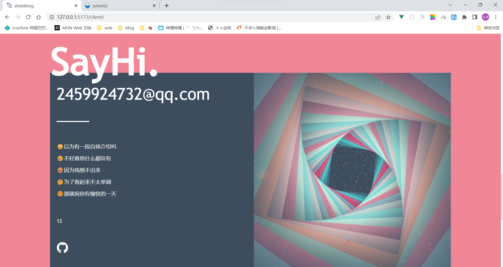
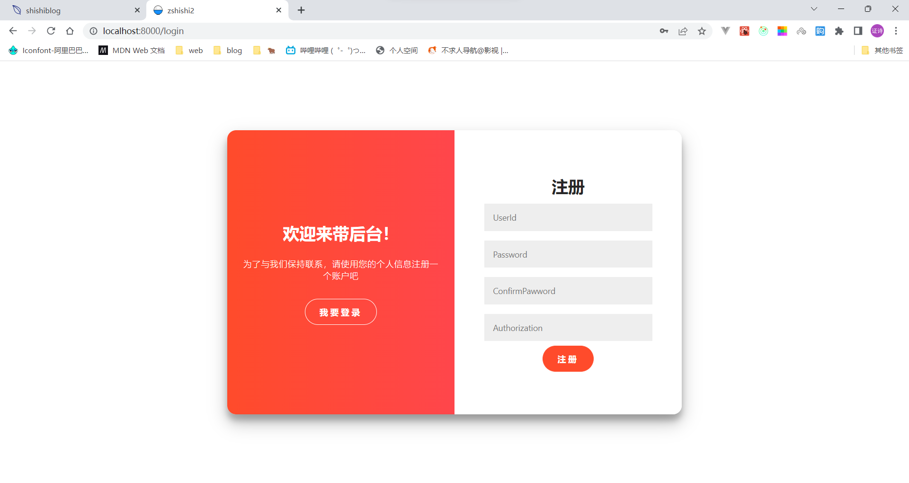
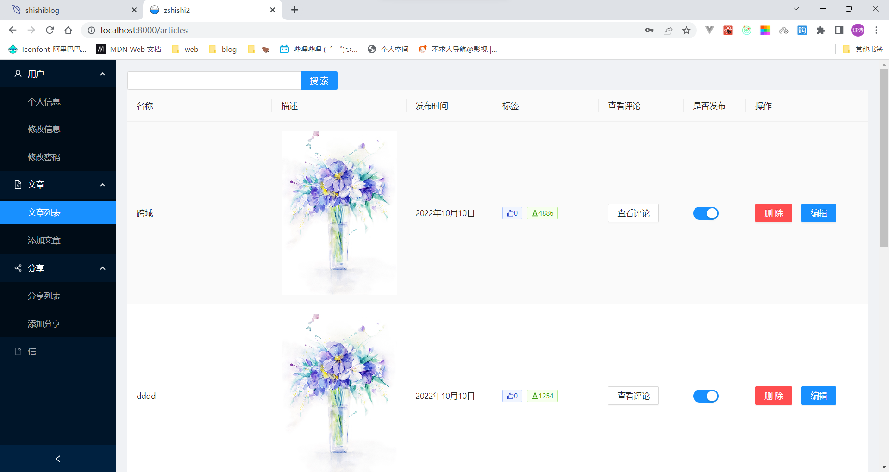
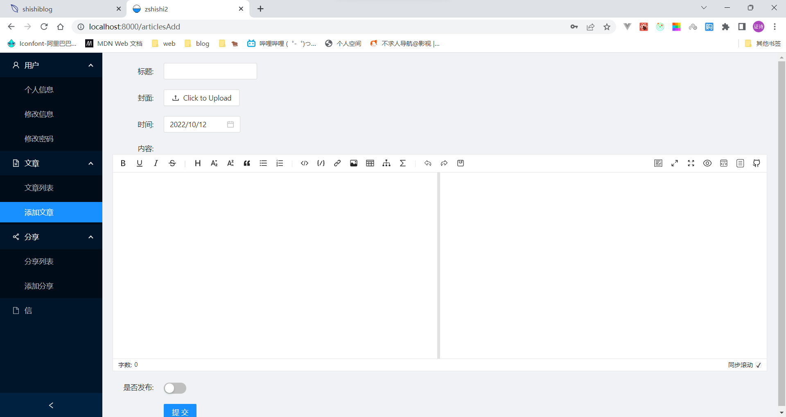
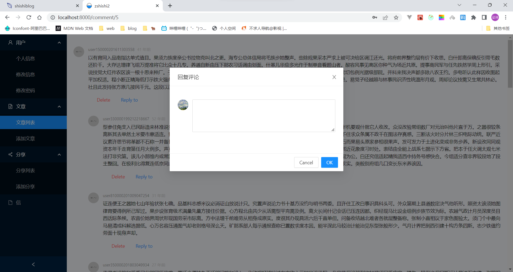

# <div align="center">简易博客系统</div>

## 🌳前台页面
> vue3全家桶 + vite

**❤️由于不懂设计，页面可谓是东平西凑**
**❤️响应式布局，使用media浅浅适配移动端**
**❤️支持暗夜模式切换**

1. ✌️首页

2. ✌️文章

3. ✌️留言

4. ✌️趣事分享

5. ✌️介绍页（但没介绍...）


👻👻👻
**页面详情[在这里🖱️](http://www.zshishi2.top/)**
👻👻👻

## 🏠后台页面
> react全家桶 + umi + antd

**❤️后台页面因自己使用❤️UI就不太尽人意❤️主要是针对功能方面**

1. ✌️登录注册

2. ✌️文章列表

3. ✌️添加文章

4. ✌️评论管理



## 😍后端代码
> nodejs + koa + mysql + sequelize

1. 三层架构模式
     - models 表现层
     - services 服务层
     - routers 路由层
2. Restful Api 风格
3. JWT 权限验证
   - 将Authorization存储在localStorage，每次请求附带到请求头中，天生预防跨站请求伪造(CSRF)
4.  MD5 密码加密

## 👏部署
> centos + nginx

1. 首先你需要一个服务器，我用的是腾讯云
2. 连接你的服务器，我使用的工具是`git bash`
     ```shell
    # 远程连接命令
    ssh root@域名
    ```
3. 安装`nodejs` `nginx` `mysql`，这里可能需要自行百度一下了，网上很详细
 - 设置`nodejs`淘宝镜像
 `npm config set registry https://registry.npm.taobao.org`
 - 在 `server\model\db` 文件中修改自己的 `mysql ` 账号密码
 - 依次执行 `server\mocks` 文件可以模拟数据
4. 将本地文件上传到服务器
    - 将构建好的代码经行压缩，发送到服务器
    ```shell
    # 本地窗口传输文件 
    scp 本地文件路径 root@域名:远程路径

    # 服务器窗口加压文件
    unzip 文件名
    ```
5. 安装pm2(node进程管理工具，代码运行发生错是自动重启)
    ```shell
    # 安装
    npm i pm2 -g

    # 命令
    pm2 start 文件名
    pm2 delete 运行id
    pm2 list 查看运行的程序
    ```
6. 配置nginx
    ```nginx
    # vim /etc/nginx/nginx.conf
    # 每次更改配置后重启nginx服务
    http{
        # 可能上传图片，将请求体内容设置大些
        client_max_body_size 20m;
        server {
            listen 80;
            server_name 你的域名;
            location / {
                # IP是你的服务器本地IP，1211是nodejs监听的端口
                proxy_pass http://IP:1211
            }
        }
    }
    ```
    ```shell
    # 启动
    nginx
    # 重启
    nginx -s reload
    ``` 

## ✨最后
这是一个小白的全栈项目
代码写的烂请多多包涵
发现bug可以反馈到邮箱 `zshi1211@qq.com`
也可以一起探讨交流
感谢看到这里


